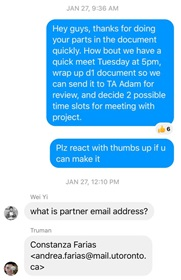

# Disability Justice Network of Ontario by Team DJNO

## Iteration 2 - Review & Retrospect

- When: March 8, 2020
- Where: BA3185 and Zoom

## Process - Reflection
After our recent review meeting, our team realized many of the decisions we made during deliverable 1 were either too idealistic and turned out to cause lots of extra work, or not helpful at all with our workflow. However, after realizing these problems during the second week of development, the team was quick to adapt and made a few adjustments to improve the process. 
#### Decisions that turned out well

1) The most important decision that turned out well and held the team together on track was the weekly meetings on Friday/Saturday. These meetings enabled us to review the progress of each member, catch up with the overall progress of the project, discuss any issues together and make critical decisions. We also had our project partners for these meetings over Zoom, allowing us to discuss and clarify and the requirements. In addition our project partner also provided us with expertise knowledge in the disability field, which helped us better understand the issue we are solving.

2) Another important decision that turned out well was the use of Facebook Messenger over Slack for everyday communication within the team (still use slack for development updates) and having everyone to check the group chat at least every 24 hours. Although Slack has features (such as channels) that causes it to be more widely used in the professional setting, it is less accessible for us (some members don’t have phones that offer the Slack app). Everyone on the team uses Messenger on a daily basis and are more likely to see new messages in our group chat. We can see members who have read a message and utilizes the thumbs up emoji as saying *agreed/understood*.

3) During the first couple of meetings, some members happen to just show up late. Therefore, we created a contract where for each meeting, the person who arrives last without any valid excuses will be responsible for providing snacks and beverages for the next meeting. This encouraged everyone to arrive on time to meetings so less time are wasted waiting and explaining the same idea multiple times.

#### Decisions that did not turn out as well as we hoped

1) One bad decision we made was choosing to use React to build our front-end framework. We made the decision due to our lack of experience in the framework, and it being very popular. We underestimated the time it took to learn each of its components. This hit us hard during deployment and we ended up using Bootstrap instead.

2) Another bad decision was to have code reviews too frequently. It allowed members to write buggy code since they feel they could rely on the reviewer to catch their mistakes. This wasted a lot of time going back and forth for each review.

3) We did not allocate sufficient time and resource on developing a good test framework. This caused us to miss a lot of simple bugs that all surfaced during integration and deployment. Ultimately causing member to get stuck and waiting for fixes on the server side. 
#### Planned Changes

- We decided to assign a member (William for now) to lead in developing a test framework for the backend. When making changes, members must make sure the tests all pass before pushing, and make any corresponding changes to test suites related to the modified code. This way, problems can be noticed and fixed during development.    

- To address the issue of frequent code reviews, we decided that each member should take ownership of his work, and we would take 30 min to 1 hour time at the beginning of each meeting for long code reviews. This task primarily falls upon Junxuan and Truman, who will make sure both the frontend and backend parts are working accordingly.

## Product - Review

- To prepare for our demo, we recorded short videos of us using features of the application on mobile and from a pc. Set up our MongoDB with some mock object instances.

- We managed to demo to our partner a model that allow a user to login using google authentication, how to set their profile and settings, and how to post and accept a request. We also showed the instantaneous changes in the database with _MongoCompass_.

- Our project partner was very pleased with our progress and our level of dedication. She provided some valuable feedback on our UI, suggesting it could be more intuitive of the end-user. 

- The one change request was related to the forms of the request-model, flipping the fields in the two forms and limit some of the choices. 

- From this demo to our project partner, we learned how to present a work-in-progress application with basic features effectively.   
